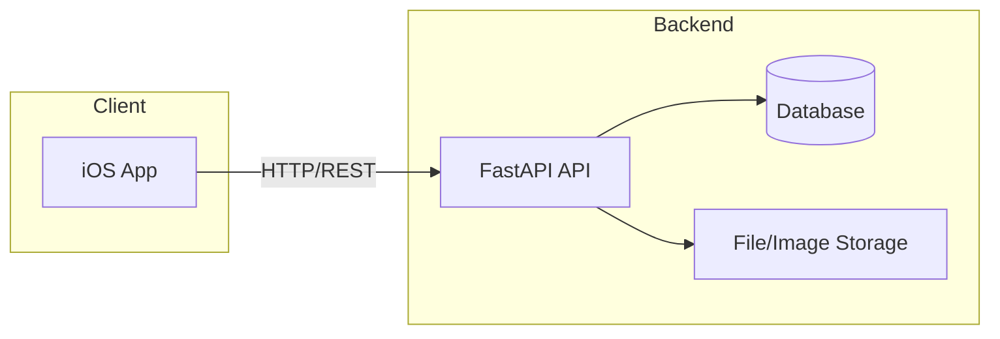

# Shareish: High-Level Architecture

This document describes the main parts of the Shareish project and how they work together. It’s aimed at someone who is fairly technical but doesn’t need low-level implementation detail.

---

## 1. Project overview

**Shareish** is a give-away marketplace: users list items they want to give away (e.g. furniture, books), and others can browse the feed and claim items. When someone claims an item, they get a link to contact the owner (e.g. via WhatsApp) to arrange pickup.

The project has two main pieces: a **backend API** (Python, FastAPI) and a **native iOS app** (Swift, SwiftUI). The backend stores users, items, and claims in a database and can store or serve listing photos. The iOS app is the only client that talks to this API; users do everything through the app.

For deployment and image storage, the repo already has focused guides: [backend/HOSTING.md](backend/HOSTING.md) explains how to run or deploy the backend (PaaS, VPS, Docker), and [backend/PERSISTENT_IMAGES.md](backend/PERSISTENT_IMAGES.md) explains how listing images are stored (local disk, Railway volume, or S3/R2).

---

## 2. Components and their roles

| Component | Role |
|-----------|------|
| **Backend (API)** | [backend/](backend/) — A REST API built with FastAPI. It handles sign-in (Firebase or dev login), creating and listing items, claiming items, and image uploads. All business logic and access to the database and file storage live here. |
| **Database** | Used only by the backend. Defined in [backend/app/database.py](backend/app/database.py) and [backend/app/models.py](backend/app/models.py). Stores users, items, and claims. Default is SQLite; production typically uses PostgreSQL. |
| **iOS app** | [ios/](ios/) — The only client. A native Swift/SwiftUI app (iOS 17+) that provides the UI for login, feed, item detail, uploading listings (including “Identify with AI”), and claiming. Every server call goes through the backend API. |
| **Persistence / images** | Listing photos are uploaded through the API. The backend saves them to local disk, a mounted volume, or an S3-compatible bucket. Behavior and options are described in [backend/PERSISTENT_IMAGES.md](backend/PERSISTENT_IMAGES.md). |

High-level flow:

---

## 3. How the pieces interact

- **User flow.** The user opens the iOS app, signs in (Firebase or dev login), and then browses the feed, views item details, lists new items (optionally using “Identify with AI” for title/description), or claims items. For each of these actions, the app sends HTTP requests (e.g. GET/POST) to the backend. The backend reads or updates the database (and, when needed, reads or writes image files), then returns JSON. The app uses that response to update the screen.

- **Backend.** A single application entrypoint: [backend/app/main.py](backend/app/main.py). It creates the FastAPI app, wires up CORS, and mounts four routers under `/api/v1`: auth, items, claims, and uploads. Routes, request/response shapes, and database access live under [backend/app/](backend/app/) (routers, models, schemas, config, and services such as the AI identifier).

- **iOS.** The app is configured via [ios/project.yml](ios/project.yml) (XcodeGen). It uses an `APIClient` (and related services) that send requests to a configurable base URL (e.g. `http://localhost:8000/api/v1` for development or your deployed API URL). The backend URL is set in the app (e.g. on the login screen or in config) so the same app can point at local or production.

- **Deployment.** The backend can run in a container ([backend/Dockerfile](backend/Dockerfile)) and is deployed as described in [backend/HOSTING.md](backend/HOSTING.md) (e.g. Railway, Render, Fly.io, or a VPS). The iOS app is built in Xcode and distributed via TestFlight or the App Store (or similar). There are no other runtime components; the diagram above is the full picture.

---

## 4. Where to look next

- **Change or add API behaviour** — [backend/app/main.py](backend/app/main.py) and the modules under `backend/app/` (especially `routers/`, `schemas.py`, and `services/`).
- **Change data shape (users, items, claims)** — [backend/app/models.py](backend/app/models.py) and database setup in [backend/app/database.py](backend/app/database.py).
- **Change the iOS UI or how the app talks to the server** — The iOS project under [ios/](ios/) (Views, ViewModels, Services such as `APIClient` and `AuthService`).
- **Understand image uploads and persistence** — [backend/PERSISTENT_IMAGES.md](backend/PERSISTENT_IMAGES.md).
- **Run or deploy the backend** — [backend/HOSTING.md](backend/HOSTING.md) and [backend/.env.example](backend/.env.example).
